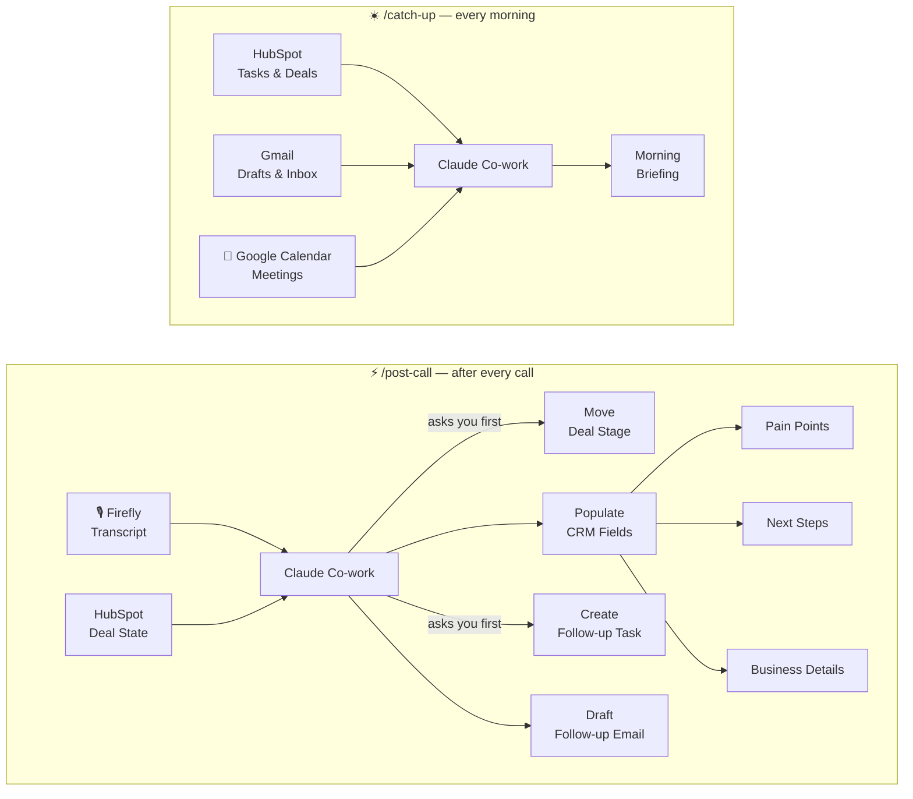

# Co-work Post-Call Skills

Claude Co-work skills for sales reps to automate post-call admin — no extra tools, no extra subscriptions.

> These skills were built as part of a YouTube tutorial. [Watch the video →](#) *(link coming soon)*

---

## What's in this repo

| Skill | Trigger | What it does |
|---|---|---|
| Post-Call | `/post-call` | After a call: checks deal stage, populates CRM fields, creates a follow-up task, drafts a personalised email |
| Catch-Up | `/catch-up` | Each morning: surfaces due tasks, drafts pending, at-risk deals, urgent emails, and today's meetings |

---

## How it works

---

## Before you start

You need the following connectors active in Claude Co-work:

- **Firefly** — so Claude can read your meeting transcripts directly
- **HubSpot** — so Claude can read and update your deals
- **Gmail** — so Claude can draft follow-up emails

**One-time HubSpot setup:** The `/post-call` skill writes to two deal properties — `Next Steps` and `Pain Points`. These need to exist in your HubSpot account before the skill can use them.

To create them: HubSpot → Settings → Properties → Deal properties → Create property

---

## How to install a skill

1. Download the `SKILL.md` file you want
2. Open it and fill in the **Your Business Context** section at the top
3. Copy the full file contents
4. In Claude Co-work, open the **Directory** → find `/skill-creator` → install it
5. Run `/skill-creator` in chat and paste in your content
6. Name the skill (e.g. `post-call`) and save

That's it. Type `/post-call` after your next call and it runs.

---

## Skills

### `/post-call`

Run this right after a sales call ends.

**What it does, step by step:**
1. Pulls your most recent Firefly transcript
2. Finds the deal in HubSpot and checks the current stage
3. Assesses whether the deal should move to the next stage — shows you the reasoning and asks before changing anything
4. Populates the deal card: next steps, pain points, and business-specific details you defined in Your Business Context
5. Creates a follow-up task in HubSpot with a due date based on how the call went — default timing is 2–3 days for high momentum, 1–2 weeks for cautious interest, 2–3 weeks for early stage. **Adjust these ranges in the skill file to match your sales cycle.**
6. Drafts a personalised follow-up email in Gmail

**Note on email sending:** Co-work saves the email as a Gmail draft. It cannot schedule sends automatically — the skill will tell you when to send it based on the task due date, and you send it manually from Gmail.

→ [Download post-call-SKILL.md](./post-call-SKILL.md)

---

### `/catch-up`

Run this at the start of your day.

Surfaces everything that needs your attention in one place: follow-up tasks due today, Gmail drafts ready to send, at-risk deals with no recent activity, urgent emails that came in overnight, and a list of today's meetings.

**What it does, step by step:**
1. Lists Gmail drafts that are unsent and flags any that are overdue
2. Pulls HubSpot tasks due today
3. Flags at-risk deals — default thresholds are 14 days no activity and 30 days no stage movement. **Adjust these in the skill file to match your sales cycle.**
4. Surfaces urgent emails that arrived since the previous business day
5. Lists today's meetings with times from Google Calendar

→ [Download catch-up-SKILL.md](./catch-up-SKILL.md)

---

## Connectors vs. subscriptions

These skills use the connectors already built into Co-work — Firefly, HubSpot, Gmail. You connect them once via OAuth in Co-work settings. No additional tools, no webhooks, no extra subscriptions required.

If you already have Firefly and HubSpot as part of your sales stack, the only cost is your Claude plan.

---

## Questions or issues

Open an issue in this repo or leave a comment on the video.
